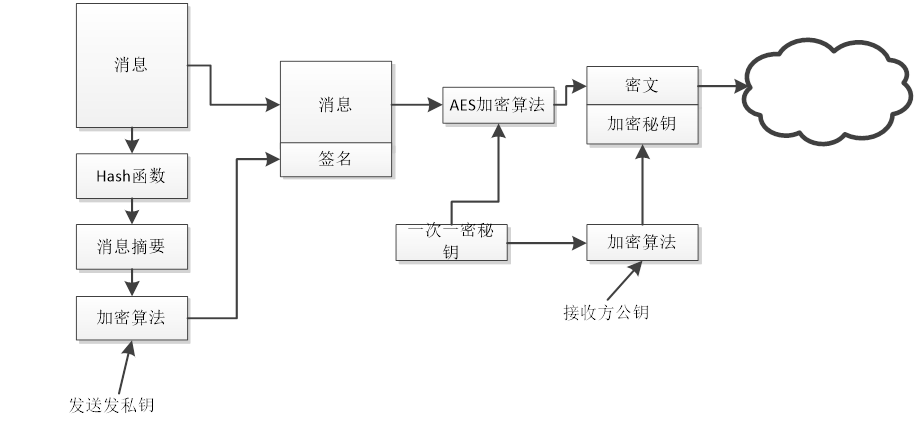
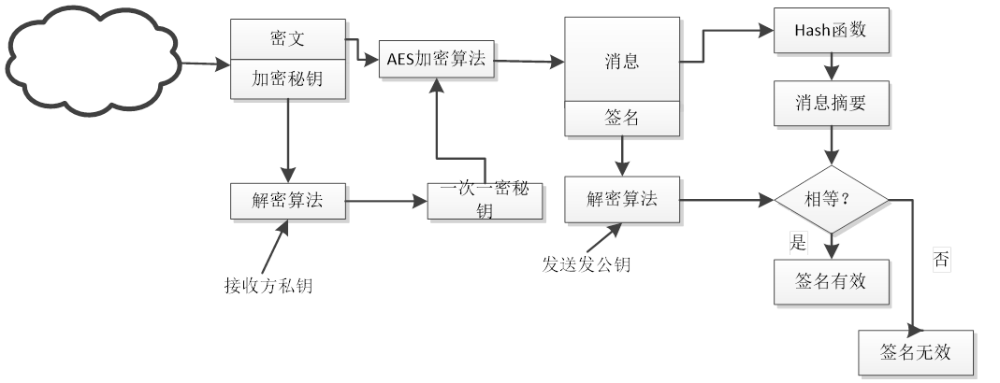

# SafeFileTransfer

文件安全传输系统

## 实现思路

为了实现一个安全文件传输系统，需要从以下几个方面进行设计和实现：

1. **系统架构设计**
   - 设计客户端和服务器端的交互方式。
   - 客户端负责文件的上传和下载。
   - 服务器端负责接收、存储和发送文件。
2. **文件加密**
   - 选择合适的对称加密算法（如AES）进行文件加密。
   - 使用非对称加密算法（如RSA）进行密钥的安全传输和管理。
3. **完整性验证**
   - 使用哈希算法（如SHA-256）生成文件的哈希值。
   - 在文件传输完成后，客户端和服务器端分别计算和比对文件的哈希值，确保文件未被篡改。
4. **身份认证**
   - 使用TLS（传输层安全）协议进行客户端和服务器端的身份认证。
   - 使用数字证书来确保身份的真实性和可靠性。

## 系统架构设计

1. **客户端**
   - 用户界面（命令行或图形界面）供用户选择文件并进行上传和下载操作。
   - 负责文件的加密和解密。
   - 负责计算文件的哈希值并进行完整性验证。
2. **服务器端**
   - 接收和存储客户端上传的文件。
   - 发送客户端请求的文件。
   - 负责计算文件的哈希值并进行完整性验证。

### 详细设计

#### 客户端

1. **文件上传流程**
    
1. **文件下载流程**
   
#### 服务器端

1. **文件接收流程**
    
1. **文件发送流程**

## Download

- clone代码 `git clone https://github.com/yoeelingBin/SafeFileTransfer.git`
- 在certs目录下生成ssl自信任证书(可选？)
- python版本3.11.9
- 初始化数据库（in mysql）: `source path/db.sql`
- 下载依赖 `pip install -r requirements.txt`

## Files Description

- certs SSL证书存放目录
- client 客户端
- common 加解密模块
- keys 客户端服务端公私钥存储
- server 服务端
- logs 日志
- test_files 测试文件
- uploaded_files 服务端存储文件
- download_files 客户端下载的文件

## Usage

- Client
  - `python .\client\client_login.py`
- Server
  - `python .\server\server.py`

## Progress

- [x] RSA非对称加密
- [x] AES对称加密
- [x] 客户端文件上传和服务端文件下载储存
- [x] 客户端下载文件，需要对服务器上的文件list，前端选择相应文件后进行下载
- [x] 密钥交换(数字信封)
- [ ] 日志
- [x] 前端或命令行，使用tkinter
